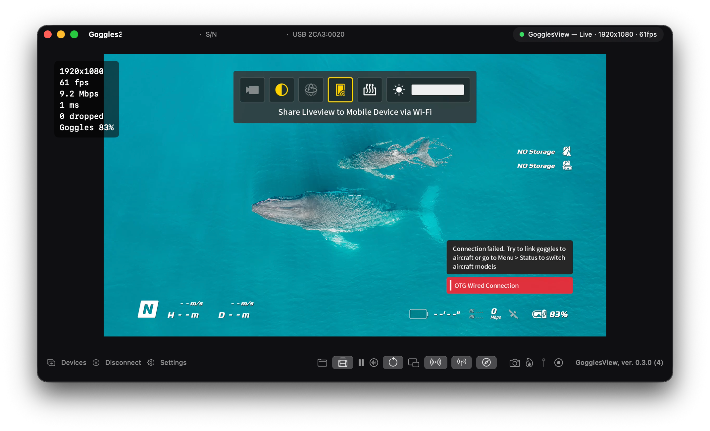
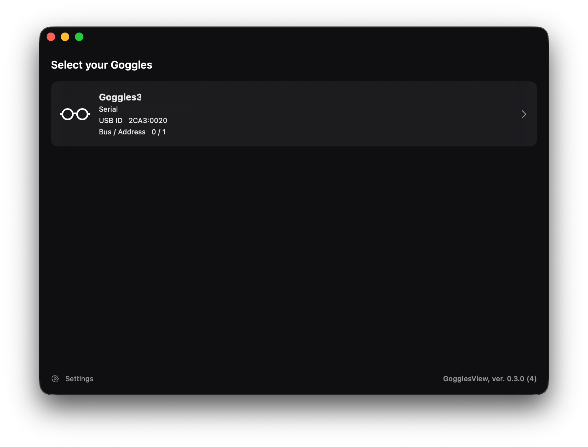
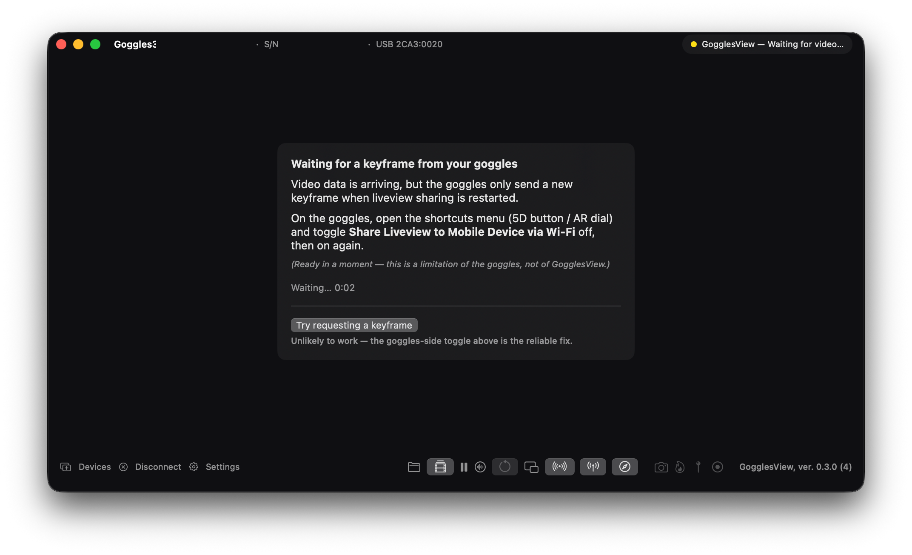
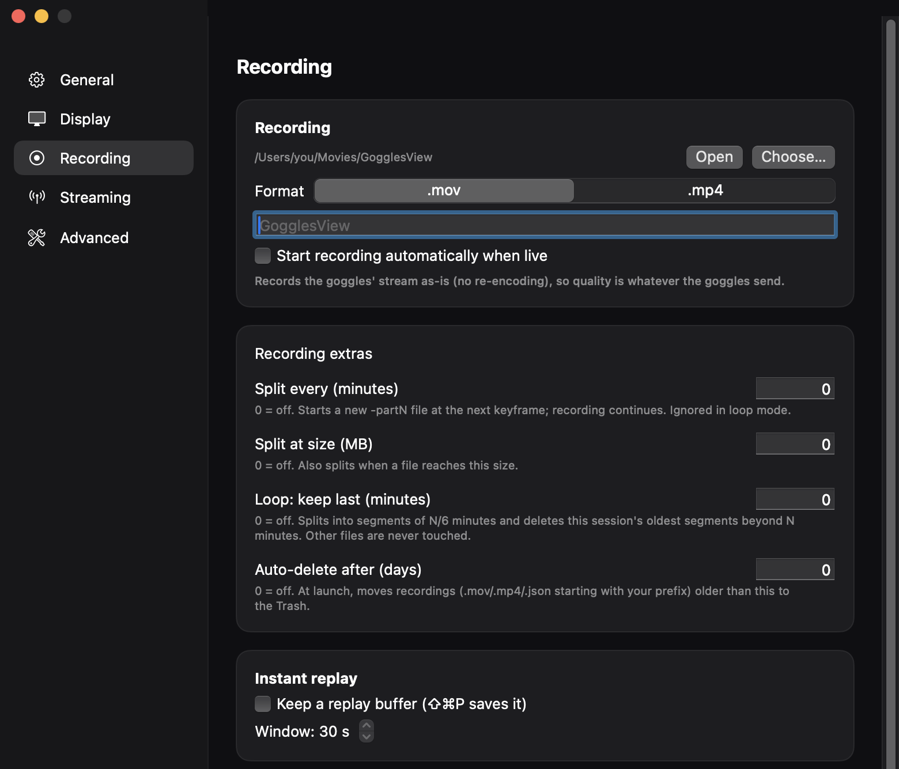
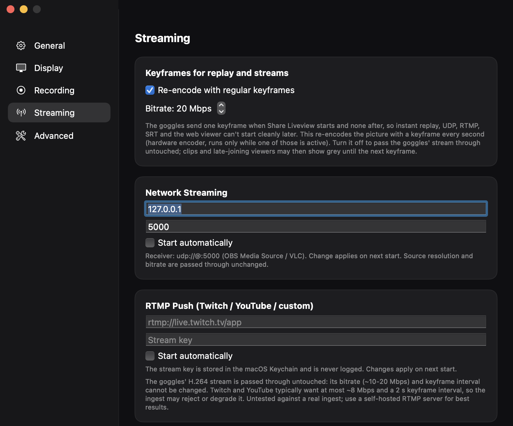
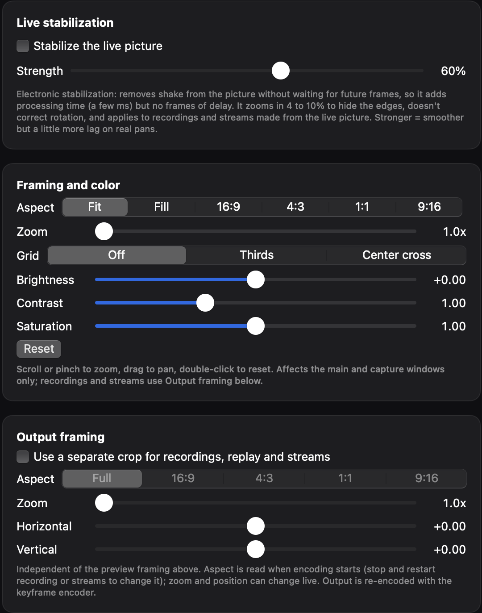
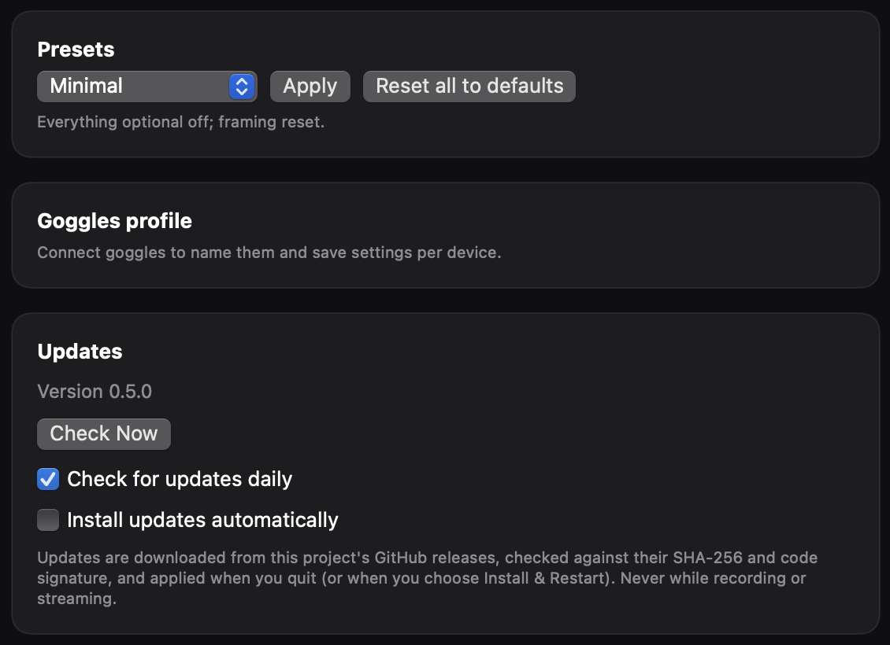
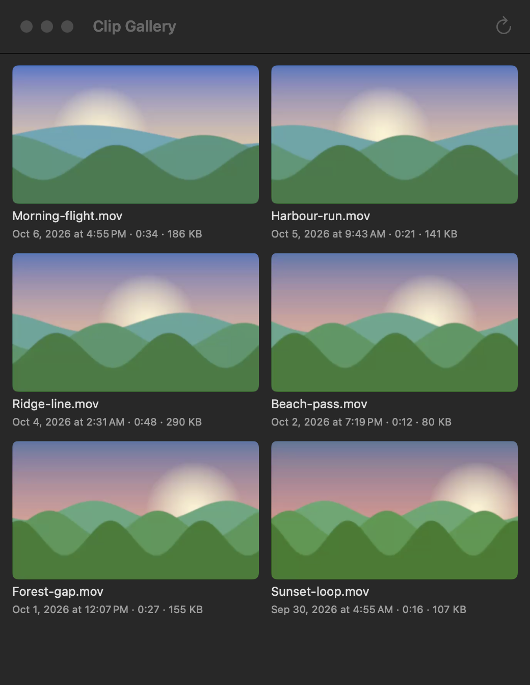
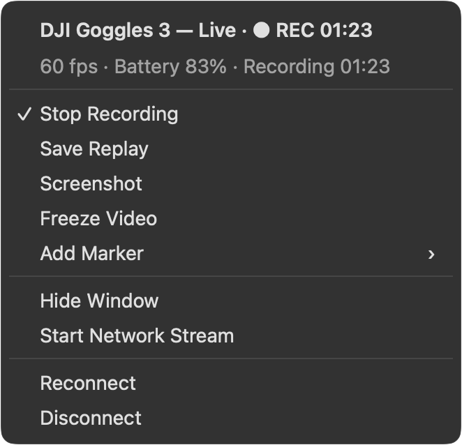
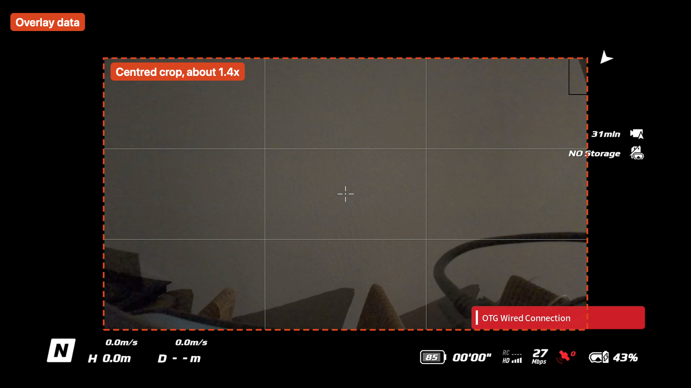

# GogglesView

[](https://github.com/Kristian-Buriasco/gogglecast/actions/workflows/ci.yml)
[](https://github.com/Kristian-Buriasco/gogglecast/releases/latest)
[](https://github.com/Kristian-Buriasco/gogglecast/releases)
[](LICENSE)


A free, native macOS app that shows the live video feed from DJI Goggles 3 on a Mac over USB-C. The protocol is reverse-engineered; no extra hardware or dongle is needed.

**[Download the latest release](https://github.com/Kristian-Buriasco/gogglecast/releases/latest)** (DMG, Apple Silicon, not notarized).



<p>
 
</p>

<p>
 
</p>

<p>
 
</p>

<p>
 
</p>

The clip gallery picture uses generated sample clips, and the menu picture is redrawn from the menu's own items.

## Features

- Live view of the goggles' video feed, H.264 passthrough decoded with VideoToolbox.
- Multi-device picker when more than one pair of goggles is attached.
- Full frame rate: 59/60 fps when the goggles send it.
- Recording of the raw stream to `.mov` or `.mp4` (no re-encode), saved to `~/Movies/GogglesView`. Optional auto-start when the stream goes live.
- Chrome-less capture window, for use as an OBS Window Capture source. Optional "keep on top".
- Stats overlay (resolution, framerate, bitrate, dropped frames), each field toggled in Settings.
- Instant replay buffer, loop recorder, auto-split, markers, clip gallery with passthrough trim and share, optional burn-in logo/text recording.
- Streaming out: UDP MPEG-TS, RTMP (Twitch/YouTube), SRT, local web viewer (HLS), NDI (experimental).
- Watch on an iPad or phone with no extra app: turn on the web viewer and "Allow other devices" in Settings, scan the QR code, optionally Add to Home Screen. See [docs/web-viewer.md](docs/web-viewer.md).
- Framing (zoom/pan/crop/grid/color), freeze, mini window, rotate/flip, per-goggles profiles and presets.
- Several goggles at once, each in its own window.
- Menu bar controls, global hotkeys, event hooks, `gogglesview://` URL scheme and AppleScript.
- Session log, benchmark/latency report, diagnostics, onboarding and self-test.
- OBS Studio control over obs-websocket (start recording and switch scenes when the goggles go live), see [docs/obs.md](docs/obs.md).
- Automatic markers that become chapters in the recording, trim that keeps them.
- Web viewer for iPad and phone: QR code, Bonjour, full screen, Add to Home Screen, see [docs/web-viewer.md](docs/web-viewer.md).
- Setup assistant, signal-lost alert, race mode, connection health window, clip gallery search and tags, copy frame, Shortcuts actions, settings backup.
- Secrets (stream key, tokens, webhooks) kept in the Keychain.
- Available in English and Italian; more languages can be added, see [docs/localization.md](docs/localization.md).

## The goggles' overlay

The goggles draw their own overlay (flight data, battery, link strength, storage warnings) into the video they send, so it also appears in OBS, recordings and streams. With a drone linked, the camera picture sat in the middle of the frame at about 70% of its width and height, with the overlay in the margins.



To get a clean picture, turn the overlay off on the goggles or crop it out. With the goggles' display scale at about 70%, a centred crop of about 1.4x (Settings > Display > Output framing zoom, or your editor) lands on the picture, and the uncropped original keeps the data. The app tells you once when you first start a stream or the capture window.

Frame rate follows what the goggles send: about 35 frames per second in our test with a drone linked, 60 in an earlier one.

## Requirements

- Apple Silicon Mac, macOS 14 (Sonoma) or later (`Package.swift` platform `.macOS(.v14)`; the bundled libusb is universal, but only arm64 has been tested).
- DJI Goggles 3 and a USB-C cable that carries data (charge-only cables will not work).
- On the goggles: Settings > About > enable "OTG Wired Connection to Computer". Unplug the goggles before toggling it, then reconnect.
- The goggles' live view must be active while streaming.

## Install and first run

Download the DMG from the Releases page, or build from source (below) / use `scripts/make-dmg.sh`. Releases are dev-signed, not notarized.

Or with Homebrew:

```bash
brew install --cask Kristian-Buriasco/gogglesview/gogglesview
```

The cask lives in [homebrew-gogglesview](https://github.com/Kristian-Buriasco/homebrew-gogglesview) and is bumped by hand after each release.

1. Copy `GogglesView.app` to `/Applications`. The build is signed with an Apple Development certificate (or ad-hoc), not notarized, so on first launch right-click the app and choose Open.
2. On first launch the app registers a privileged helper daemon (`GogglesHelper`) via `SMAppService`. macOS requires one-time approval: System Settings > General > Login Items & Extensions, enable GogglesView. The helper owns the USB device; the app talks to it over XPC.
3. Enable OTG on the goggles, connect them, start live view.

## Build from source

Requires Xcode or the Command Line Tools with a Swift toolchain that supports macOS 14.

```bash
Apps/GogglesView/build-stub-bundle.sh            # -> Apps/GogglesView/build/GogglesView.app
Apps/GogglesView/build-stub-bundle.sh /some/dir  # custom output dir
scripts/make-dmg.sh                              # -> dist/GogglesView-<version>.dmg
```

The script builds the helper and app in release mode and assembles the bundle. It signs with `GOGGLESVIEW_SIGN_IDENTITY` if set, else the first valid codesigning identity in your keychain, else ad-hoc.

Tests: `Packages/swift-test-clt.sh <package dir>` (see the script for why it exists on a Command Line Tools-only machine).

Entitlements live in `Apps/GogglesView/BundleResources/`. `GogglesView.entitlements` is the default. `GogglesView-with-extension-install.entitlements` adds the system-extension install entitlement for the future OBS virtual camera; it needs a paid Apple Developer Program membership (the app fails to launch with AMFI -413 otherwise), so it is opt-in via `GOGGLESVIEW_WITH_EXTENSION_INSTALL=1` and not used in normal builds. See `docs/dev-setup.md`.

## Status

Core live view, recording and the 60 fps path are hardware-tested. Many newer features (RTMP/SRT/NDI outputs, multi-window, trim, hooks, burn-in) are unit-tested but have had limited testing on real goggles; please file issues.

## Automation

Shortcuts, Stream Deck, Raycast, `open "gogglesview://record/toggle"` and AppleScript can drive recording, replay, screenshots, freeze, markers and the UDP stream. See `docs/automation.md`. Toggle in Settings > Advanced > Automation.

## License

GPL-3.0-or-later. See `LICENSE` and `THIRD_PARTY_NOTICES.md`.

GogglesView is an independent project, not affiliated with or endorsed by DJI. "DJI" and "Goggles 3" are trademarks of their owners; the protocol was reverse-engineered for interoperability. Use at your own risk. Contributions: `CONTRIBUTING.md`. Help: `SUPPORT.md`. Security: `SECURITY.md`. Conduct: `CODE_OF_CONDUCT.md`.

## Troubleshooting

- Goggles not detected: try another USB-C port and a known data cable; confirm "OTG Wired Connection to Computer" is on (unplug before toggling); confirm the helper is approved in Login Items & Extensions.
- Connected but no picture: the stream only starts while the goggles' live view is active.
- Frame rate is ~30 fps instead of 60: that is determined by the goggles' own encode mode, not by the app.
- Stuck after helper changes: unregister and re-register the helper (see `docs/dev-setup.md`).

## Known limitations

- OBS virtual camera ("DJI Goggles 3", CMIO camera extension) is built but untested: it needs a paid Apple Developer Program membership to install (see `docs/dev-setup.md`). Until then, use the capture window with OBS Window Capture.
- Not notarized; dev-signed. Gatekeeper requires right-click > Open.
- Pass-through of the goggles' encoded stream only: no audio, no re-encoding or scaling controls.

## Architecture

- `Apps/GogglesView`: SwiftUI/AppKit app. Decodes H.264 NALs (`DecodeSession`), renders, records (`Recorder`, `AVAssetWriter`), and manages windows/menu bar. Talks to the helper through `HelperClient` (XPC).
- `Helper/GogglesHelper`: root launch daemon registered with `SMAppService`. Enumerates and claims goggles over libusb, runs the protocol, fans video out to the app per device.
- `Packages/`: `GogglesUSB` (transport), `GogglesProtocol` (framing/handshake), `GogglesXPC` (shared XPC interface), `CLibusb` (vendored libusb in `Vendor/`).
- `Extension/GogglesCamera`: unfinished CMIO camera extension spike.

More detail: `docs/design.md`, `docs/dev-setup.md`, `docs/parity-results.md`.
